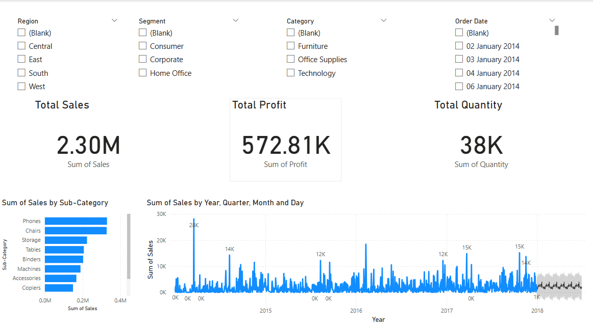

# 📊 Sales Analysis & Forecasting Dashboard

An interactive Power BI dashboard project to analyze and forecast sales performance using real-world data.

---

## 🚀 Features

- 💰 **KPI Cards**: Total Sales, Profit, and Quantity
- 📈 **Line Chart with Forecasting**: Sales trend over time with future projection
- 📦 **Top 10 Sub-Categories by Sales**: Sorted horizontal bar chart
- 🧭 **Interactive Slicers**: Region, Segment, Category, and Order Date
- 📊 **Dynamic Filtering**: Visuals respond to slicer selections for better insights

---

## 🛠️ Tools Used

- **Power BI** – Data visualization and dashboard creation  
- **Excel** – Data cleaning and preprocessing  
- **GitHub** – Version control and project sharing

---

## 📁 Project Files

| File Name               | Description                              |
|-------------------------|------------------------------------------|
| `Sales_Data.xlsx`       | Cleaned sales dataset used in the project  
| `Sales_Analysis.pbix`   | Power BI dashboard file  
| `dashboard.png`         | Visual preview of the dashboard  

---

## 📷 Dashboard Preview

---

## 📌 Project Summary

This project simulates a real-world sales dashboard with forecasting capabilities. It enables users to:
- Analyze total sales, profits, and product quantities
- Explore monthly sales patterns and future trends
- Identify top-selling product sub-categories
- Filter data dynamically by multiple business dimensions

The dashboard is designed to give business users **quick, actionable insights** to make data-driven decisions.

---

## 👨‍💼 About Me

I'm **Dammalapati Uhesh**, a Computer Science graduate passionate about turning data into insights.  
Currently **seeking full-time roles** in **Data Analytics** or **Business Intelligence**.

📫 uheshchowdary@gmail.com  
🔗 [LinkedIn](https://www.linkedin.com/in/uhesh-dammalapati-955bb8243)  
🌐 [GitHub](https://github.com/uheshdammalapati)

---

⭐️ Feel free to fork this repo, explore the dashboard, and connect with me!
